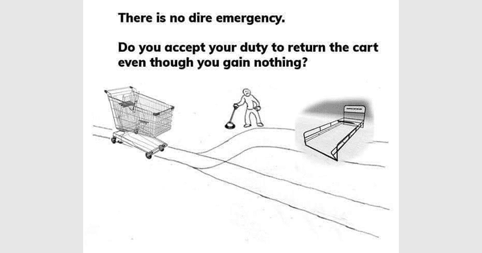

There was a meme I saw recently which described so-called “Shopping Cart Theory”. It's an amusing spin on the moral dilemma from philosophy known as the The Trolley Problem, which is also its own amusing meme (because in the Internet Age everything has to become a meme). The obvious question the memes poses is basically: are you a moral person?

<!--  -->

I think the actual question of the meme can basically be boiled down to: “do you do something for the greater good even when you don’t benefit from it?” It’s an interesting question if you shift the context to software development, specifically Pull Requests.

## The problem

Assuming you’ve worked professionally as a software developer for at least a year or so, you’ve almost certainly been asked to review some monstrosity of a Pull Request (PR) where the developer who opened the PR didn’t make the slightest attempt to reduce the work you would have to put in to understanding the PR.

It might have been a PR with several hundred, or even over a thousand lines of code changed. Maybe it was a PR that changed a sizable amount of configuration in a way that didn’t make sense or lacked context. Or maybe it was simply a PR meant to change the appearance of some UI element but the PR didn’t actually have any before or after screenshots.

In all of the above cases, as well as plenty of others that I didn’t bother to list, the issue is that the engineer who created the PR is putting a burden onto the engineer reviewing the PR.

You can probably see why I compared this to the Shopping Cart Dilemma.

In the Shopping Cart Dilemma, you’re given the choice of returning the shopping cart to the designated area and reducing the workload of the employees at the store. It also reduces issues caused by shopping carts being scattered around parking lots (things like shopping carts blocking parking spots or shopping carts getting dinging vehicles as the carts get blown around on windy days).

Alternatively, you can take the selfish route and simply leave the shopping cart abandoned in the parking lot, which will require more work from the store employees to gather and/or lead to inconveniences in the parking lot for other shoppers.

With both the Shopping Cart Dilemma and terrible PRs, the root issue is the same: individuals choosing a selfish path that increases their own convenience by inconveniencing others.

I’m going to assume you’re an adult and I don’t need to tell you why being “that person” makes you a garbage human being, so instead I want to focus on the steps you can take to avoid being “that person” and instead create great PRs that make life easier for your teammates.

## Providing Context.

If you think about the hardest Pull Requests you’ve had to deal with, the issue is always that it's hard to ascertain all the required context surrounding the code changes. If you can’t understand the context of the changes, it’s difficult to confidently approve a PR.

Sure, a dev doesn’t need to know the context of the changes in order to catch things like typos, obvious bad practices, or certain logical bugs in the code. But that's a small list of things compared to everything that a reviewer could catch in a PR where they actually have context.

When a reviewer has all the context necessary to understand the changes being made as part of a PR, they can ask about edge-cases the PR author might not have considered; they can discuss other approaches that might better solve the problem(s) the PR is meant to solve; they can provide additional context around the problem that that the PR author themselves might have been unaware of.

There's a long list of good things that can come up when a reviewer has all the context necessary to understand a PR. But if you create a PR that prevents reviewers from understanding all the context, then you deprive them of the ability to provide a thorough review while also depriving yourself of what might have been useful feedback on your PR.

Obviously, that’s not good.

Instead, you should seek to maximize the amount of context you provide reviewers, at least up to the point where they know everything they need to know in order to review your changes. This improves your odds of receiving thorough peer reviews and merging in the highest quality code you can after addressing any feedback.

## So, how do you actually achieve that?

Well, I’m currently a frontend engineer so the steps I'm going to mention may not cover everything worth doing if you’re a backend engineer or a data scientist. Nonetheless, something I think is universally applicable is...

### Reviewing your own PR after you open it.

As soon as you open your PR, start going through the git diff and adding comments. Great comments generally explain why something was done. These are changes that might not be so complex they merit a comment in the source code but a reviewer might still have questions about why those changes were made. Anticipate those questions and try to answer them in the PR comments ahead of time so that you and your reviewer don’t need to comment back-and-forth on the PR to answer a question you could have easily foreseen.

Another huge benefit to reviewing your own PR and commenting as you go through it is that you may catch things that you didn’t notice locally.

This happens to me all the time, where I’m reviewing my own branch after opening the PR and I realize I left some comments that I meant to remove or any of the other small things that are easy to forget about during local development.

The diff that you see in your Pull Request is the exact same diff your reviewers are going to see, so if you’re seeing things during self-review that you know need to be addressed then it makes sense to go and fix them rather than waiting for reviewers to bring up questions about those parts of the code.

Basically, if we can catch issues to address during self-review or anticipate questions from reviewers and address them by commenting on the changed lines to add context, then you reduce the workload of your reviewers and improve their ability to focus on things that you yourself did not notice.

This leads to the next big thing, which hopefully you were already aware of.

### Keep your PRs small.

Every programmer I know has had the experience of being asked to review a huge PR. We all hate it for the same reason: it’s simply not feasible to provide a good code review on a huge PR, at least not without dedicating a massive chunk of our time.

There’s a funny saying I heard that went something like “Give a programmer a 30 line PR to review and he’ll catch 3 bugs. Give a programmer a 3000 line PR and he won’t find a single bug.” It’s funny, but I also find it to be incredibly true.

There are many reasons that large PRs are less likely to receive a thorough review.

The most obvious one is time. Asking someone else to thoroughly review 2000 lines of code that they themselves did not write is basically asking them to give you an hour or more of their time. At most companies, software engineers are all busy with their own work so when you ask other engineers to stop what they’re doing in order to dedicate a bunch of their time towards moving your own work forward you’re being a bit of an ass. It may not seem like it to you, but in these situations you have to realize that you are draining their time in order to maximize your own time, like some sort of Time Vampire.

Another issue with large PRs is that it's tough to understand all the context behind the changes and it’s also mentally fatiguing trying to catch every little bug.

When you make changes that span hundreds or thousands of lines, there’s a decent chance you made that change over several days. To you, the change probably makes perfect sense. But the reality is that reading and writing code is a slow process even for experienced programmers, and so if you wrote 1000+ lines in 5 days, asking your reviewer to understand and review those 1000+ lines within an acceptable timeframe for peer review (~15 minutes or less) simply isn’t feasible.

As a result, the reviewers can try to catch as much as they can but they will almost certainly only catch a fraction of the issues rather than all of the issues they might have noticed if the PR had been broken into chunks.

The solution here is pretty simple: if you need to make a large number of changes, make multiple PRs rather than batching the changes in one huge PR.

You can do this by either pushing into the main branch over a series of smaller PRs, or by creating a separate branch and then opening smaller PRs into that one before merging it into the main branch once all the smaller changes are approved. Both options are good and which one is “better” just depends on the changes involved.

### Providing non-code context.

Many Pull Requests include changes that aren't easy to reason about just by looking at the code but can be easily clarified by adding a little extra information. As a frontend engineer, the example that most obviously leaps to my mind is screenshots.

If someone is making a change to the User Interface, I want to see screenshots in the PR that provide a clear before/after comparison. I can get a decent idea of the changes made to the UI based on reading the code, but seeing the updated UI makes things undeniably clear.

This is especially helpful if there is a design the PR author was actually meant to code against, such as a Figma spec from the design team attached to the original Jira ticket. If I’m your reviewer, then I definitely want to make sure that the UI you’ve created actually lines up with the UI design proposed, but if you don’t provide me with screenshots that make it easy for me to compare the before/after then my only other option is to clone down your branch and run it locally to see the changes. Again, asking your reviewers to do this because you were too lazy to grab the screenshots yourself is disrespectful of their time.

I’m not totally sure if there are any backend or AI equivalents to the example I’m giving here, but the underlying idea is the same: if there is additional context you can give to your interviewers which might not be clear from the code changes alone, make sure to do so.

## A Quality Codebase requires Quality Code Review

While some individuals may be “better” at coding certain things than others, no one is a master of everything. More importantly, we are all human and even the best engineers in a company make mistakes. With that in mind, the only way to truly build up a codebase that is full of quality, thought-out code is through quality peer reviews.

It’s easy to get lazy if you’ve been coding something for a long while or you’re under pressure to deliver as quickly as possible, but making low-quality PRs doesn’t help your team overall -- it only helps you.

So to return to “The Shopping Cart dilemma” I mentioned at the beginning of this post, if there is no dire emergency will you take the time to make higher quality PRs even if the benefits aren’t obvious?
