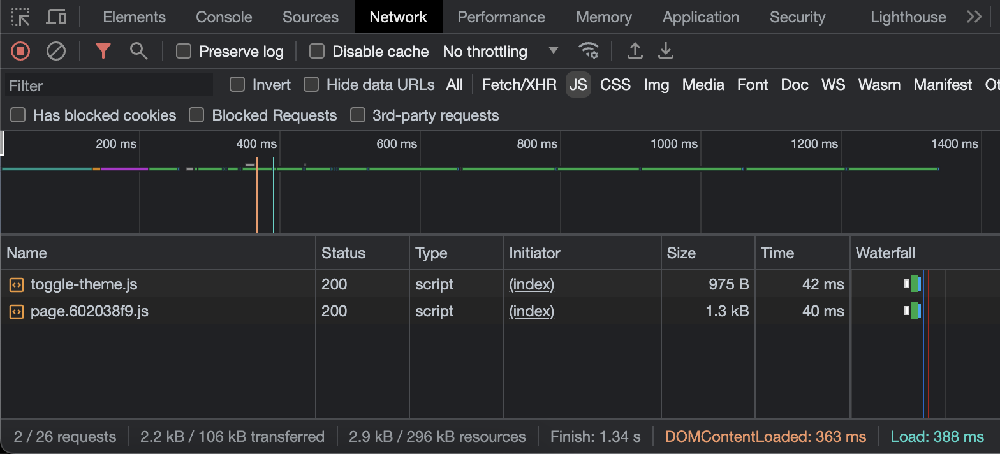

I've been wanting to get into writing blogs again but kept putting it off because I was unhappy with the architecture of my site. As part of a recent rewrite, I chose to use Astro and wanted to write up my thoughts on the developer experience and where it shines (and where I think it can improve).


<h2 id="the-good"><a href="#the-good">The Good</a></h2>

Astro gets a lot of things right when it comes to building multi-page applications. It's easy to get started with, most of the default choices are ones that I agree with, and everything about it is pretty fast. Just to highlight a few areas that I found interesting...

<h3 id="zero-runtime-javascript"><a href="#zero-runtime-javascript">Zero Runtime Javascript</a></h3>

Considering that a blog is primarily made of static content, it makes sense that you shouldn't really need to ship much (if any) JavaScript to your site visitors. JavaScript should be used for adding interactivity to pages or adding functionality that HTML can't natively support very well (such as client-side routing), which means that a static site shouldn _need_ much JavaScript.

Of course the problem is that you probably want to use JavaScript while authoring your site because there are a lot of things that are far easier to do programmatically, such as fetching all of the blog posts and turning them into blog pages.

Astro strikes a great balance here by allowing you to write JavaScript/TypeScript within your `.astro` files and then execute that JavaScript at build-time without requiring any of it to be executed by the user at run time. This is in contrast to other static site generators like NextJS, which do allow you to compile _most_ of your JavaScript at build time but still requires you to ship a decent amount of JavaScript to the browser for your site to work properly (although React Server Components do help reduce this cost).

Of course, sometimes you do need some client-side JavaScript for certain forms of interactivity. Astro supports this via "Islands" which are [interactive UI component on an otherwise static page of HTML](https://docs.astro.build/en/concepts/islands/). Basically, Astro defaults to shipping 0kb of JS but you have the optiona of shipping some JS for interactivity where it makes sense.

To share some examples from this website, I wound up shipping a small amount of vanilla JS (<1kb) so that the pages can determine whether to render the site in a light or dark theme, some more JS to enable page prefetching within AStro, and lastly some Solid.js to support client side search functionality on the search page.

<!-- TODO: add captions for sighted users -->
<!-- TODO: make this image zoomable on mobile devices somehow -->
<!-- TODO: make full width -->



<h3 id="integrations"><a href="#integrations">Easy integration with your preferred UI library</a></h3>

As hinted at in the previous section, Astro islands allow you to statically render any other UI framework of your choice. To me, this is one of the coolest things about Astro since building with Astro doesn't lock you into using _just_ Astro. If you like React and want to be able to leverage the vast ecosystem around it, you can totally write some React components and render them as Astro islands. If you prefer a leaner, more performant framework like Solid.js or Svelte, the Astro build chain supports those options as well.

To be clear, you might not even need one of these frameworks since Astro itself supports JSX and reusable components within `.astro` files. But if you're doing something that would be easier with a framework that allows for state or reactivity, you can leverage that framework where it makes sense.

This is a really welcome change when compared against other frameworks offering static-site-generation like NextJS (React) or Nuxt (Vue) since it basically ensures you can get the best of all worlds. Astro encourages you to write as much of your site in Astro as you can since that ensures optimal performance, but you can still leverage a more client-oriented JS framework whenever you need to do something that can't be fully achieved via static HTML/CSS (such as client-side search functionality)

<h3 id="typesafe-markdown"><a href="#typesafe-markdown">Typesafe Markdown</a></h3>

I haven't used a ton of other static site generators besides Astro and NextJS, so this feature may not be overly unique. But regardless, I was very happy to learn that you can make your markdown typesafe very easily in Astro thanks to [Astro content collections](https://docs.astro.build/en/guides/content-collections/#defining-a-collection-schema). This helps you ensure that your markdown files are all following a required schema so that you don't accidentally try to generate a blog post from a markdown file that happens to be missing some required field, such as a a publication date.

I found it extremely easy to get up and running with this, and it makes authoring markdown content locally (as opposed to using a Content Management System) a much easier experience.

<hr />

<h2 id="room-for-improvements"><a href="#room-for-improvements">Room For Improvements</a></h2>

With some of my favorite highlights out of the way, I'd also like to discuss some of the areas where I felt Astro was missing the mark.

<h3 id="optimizing-output"><a href="#optimizing-output">Fully optimizing the output build was not simple</a></h3>

For a framework that focuses primarily on static sites, I was surprised that Astro didn't deliver certain optimizations by default. Instead, I had to read through the documentation as well as some additional external sites to figure out how to get Astro to optimize things like fonts and images.

<h4 id="font-optimization"><a href="#font-optimization">Font Optimization</a></h4>

Experienced frontend developers already know that ensuring the right font is available is critical if you want to avoid the dreaded Flash Of Unstyled Text (FOUT).

For those that aren't familiar, FOUT occurs when the browser has fully parsed your CSS and HTML but your CSS requests non-system fonts that must be loaded over the network and they haven't finished loading prior to the browser rendering your page. The end result is that the user sees the entire page render in a system font that is available on their device and then a short time later all of the text on the page gets rerendered using the intended font once the browser is done fetching it. This creates a jarring user experience and is a common issue for websites that load quickly.

The solution to FOUT generally involves self-hosting the font so that it doesnt require an additional network connection to a different domain and can therefore load in quicker, but there are also additional font optimizations that can further improve performance such as subsetting the font in order to avoid loading in unnecessary glyphs that your pages don't need.

Unfortunately, despite font optimization being a common issue that many sites need to tackle if they want to deliver a performant user experience, Astro does not currently offer any sort of framework-level solution.

I wound up using the [subfont npm package](https://www.npmjs.com/package/subfont) and running it as part of my build script since it handles all the work of subsetting the font and creating a self-hosted copy. Additionally, I chose to set the font-display to "fallback" so that the browser won't actually render the text on the page until the font file is fully loaded in, ensuring that FOUT basically never occurs as long as the user's network connection doesn't experience an error.

The good news is that this setup definitely works and I was able to shave off >15kb thanks to the font subsetting while ensuring the page is fully rendered in <200ms on average _without_ showing the incorrect font at any point.

<!-- TODO: convert to MDX in order to add the `full-bleed` class name -->


The downside to this approach is using an npm package to scan all of the output generated by Astro winds up being a pretty slow approach since I'm not able to leverage a more performant framework-level solution. I'm also confident that many Astro users won't actually stumble upon this solution since it's not actually mentioned anywhere in the Astro docs and the `subfont` package itself doesn't seem to be widely known, at least based on the npm download statistics.

I feel very strongly that any framework that wants to focus on creating highly performant sites needs to offer a solution for font-loading because it's such a common issue and it can be a tough problem to solve on your own. I'll give some credit to Astro because after searching the community Discord server I was able to see [some discussions around adding a solution to this problem directly into the framework](https://discord.com/channels/830184174198718474/872579324446928896/1046661154514145320), although it doesn't look like there has really been any progress on the matter since the initial discussion in late 2022.

<h4 id="images"><a href="#images">Images</a></h4>

Another area that felt a bit clunky to me was image optimization. Unlike font optimization, this is actually something that Astro does support natively which is nice. But I'm mentioning it within the "drawbacks" section primarily because it wasn't actually clear how to get it working.

For starters, Astro points to their `@astrojs/image` package within their [integration docs](https://docs.astro.build/en/guides/integrations-guide/image), and all the documentation on that page makes it seem like that package is up to date and intended for use. However I later stumbled onto the [Astro Assets documentation](https://docs.astro.build/en/guides/assets/), which says right at the beginning that Assets are meant to replace the `@astrojs/image` package. I found this pretty confusing and it definitely added to the mental overhead of optimizing my Astro site. In contrast, when I look at NextJS [their instructions for image optimization](https://nextjs.org/docs/pages/building-your-application/optimizing/images) feel far more straightforward.

To make matters a bit worse, _neither_ of the Astro image optimization tools are actually enabled by default when you bootstrap a new Astro site. As I mentioned when discussing font optimization, the decision to _not_ enable extremely common optimizations by default doesn't make a whole lot of sense to me. I'm not a framework author so it's possible that I'm missing a very obvious reason that optimizing these assets isn't the default behavior of Astro, but I'm not really sure if there's ever a situation where you _wouldn't_ want to automatically optimize your images by default. I assume that if there is such a situation, it's probably not one that the majority of developers will encounter, and so it seems like you would want to enable these optimizations out of the box while making it easy to opt out of them in the rare situation that you need to.

All that said, while it took me a bit to figure out the correct way to optimize my images I was at least glad that this was something baked into Astro. Similar to font optimization, ensuring that your images are performant is something that almost every website will need to handle and it's not something that's easy to get right if you're trying to do it manually.

<h4 id="prefetching"><a href="#prefetching">Prefetching Links</a></h4>

One big drawback to multi-page applications (MPAs) when compared against single-page applications (SPAs) is navigation. The default behavior in a MPA is to request all of the resources for a route after the user has already landed on that route. This is in contrast to a SPA, where you probably already have at least some amount of the code necessary for the next route downloaded. For example, if "route 1" and "route 2" both use the same header and footer code, then the SPA doesn't need to download any additional assets as the user navigates between those routes. But with a MPA architecture, the user is forced to fully download all assets for each page as they go from route to route and this can cause some performance drawbacks.

The simplest solution to this issue is to simply "prefetch" the assets for every visible anchor tag in the viewport. By prefetching the assets for each anchor link, if a user clicks a link that causes them to navigate from "route 1" to "route 2" the navigation between those pages will basically be immediate since the browser will already have downloaded all of the assets for "route 2" while the user was still viewing "route 1".

NextJS does this by default if you use their Static Site Generation (SSG) as the output target, but you can actually do this sort of prefetching without a framework. It's supported to an extent by native HTML via the `rel="prefetch"` attribute on anchor tags, but there are also open source libraries such as [quicklink for the Chrome team](https://github.com/GoogleChromeLabs/quicklink) which add a few nifty optimizations.

Similar to image optimization, link prefetching is something that Astro does support natively via [the `@astrojs/prefetch` package](https://docs.astro.build/en/guides/integrations-guide/prefetch/#overview) which is great, but it's also not enabled by default. Developers have to search the docs to learn about this capability and then integrate it themselves. This is yet another instance where it feels like some of the defaults used by Astro aren't really in line with the defaults necessary to achieve optimal performance, even though Astro definitely has the ability.

Additionally, the defaults chosen by the prefetch package once you have it integrated also feel a bit weird to me. The package only prefetches anchor tags that have `rel="prefetch"` added to them in the source code, rather than just prefetching all anchor tags to ensure that every route change is as fast as possible.

The good news is that after reading the prefetch integration docs I realize it was reasonably easy to change the default behavior by simply updating the Astro config file from

```javascript
import { defineConfig } from "astro/config";
import prefetch from "@astrojs/prefetch";

export default defineConfig({
  // ...
  integrations: [prefetch()],
});
```

to

```javascript
import { defineConfig } from "astro/config";
import prefetch from "@astrojs/prefetch";

export default defineConfig({
  // ...
  integrations: [
    prefetch({
      selector: "a",
    }),
  ],
});
```

This change tells the integration to prefetch all anchor tags rather than just the ones with the `rel="prefetch"` attribute. So achieving the behavior necessary to optimize performance is pretty easy in this case, but it does feel like the default choice (only prefetching specific links) is a bit odd if the goal is to deliver the best possible user experience.

I can kind of understand this to an extent, since I can imagine there are a decent number of situations where you wouldn't want to prefetch the assets for a route, but it still feels like the default behavior should be "prefetch everything" while allowing the developer to opt _out_ of this behavior.

Again, I don't want to complain too much here because prefetching is something that Astro supports natively and it's not too hard to wire up, I just question whether the defaults the Astro team has chosen are conducive to ensuring that Astro sites are performant by default.

<h2 id="the-end-result"><a href="#the-end-result">The End Result</a></h2>

Despite some of the drawbacks I mentioned earlier, the overall experience with Astro is great for building static sites. The project configuration is reasonably simple, and most of the things a developer will care about are covered by the official docs.

Developers looking to fully optimize their sites performance may experience some frustration by the seemingly obvious optimizations that Astro _doesn't_ opt in to by default, but overall the experience is good and optimizing things doesn't take too much additional effort. Astro itself is still a young framework in the grand scheme of things, and the team behind it is relatively small and doesn't have the massive financial backing of competing frameworks like NextJS.

For them to have built such a fantastic framework under these constraints is extremely impressive, and I suspect that in the future a lot of the drawbacks I mentioned won't actually be issues anymore. Font optimization will probably have a native solution of some sort, and the Astro defaults will probably do more of this optimization out of the box rather than requiring additional opt-in work from developers.

On a final note, it's important to remember that I didn't come anywhere close to mentioning all of the good things about Astro, and so this article might make it seem like my view of Astro is about as negative as it positive. That couldn't be further from the truth though -- Astro is an **excellent** framework for multipage apps and after using it I really can't imagine using a different framework for that sort of application.
