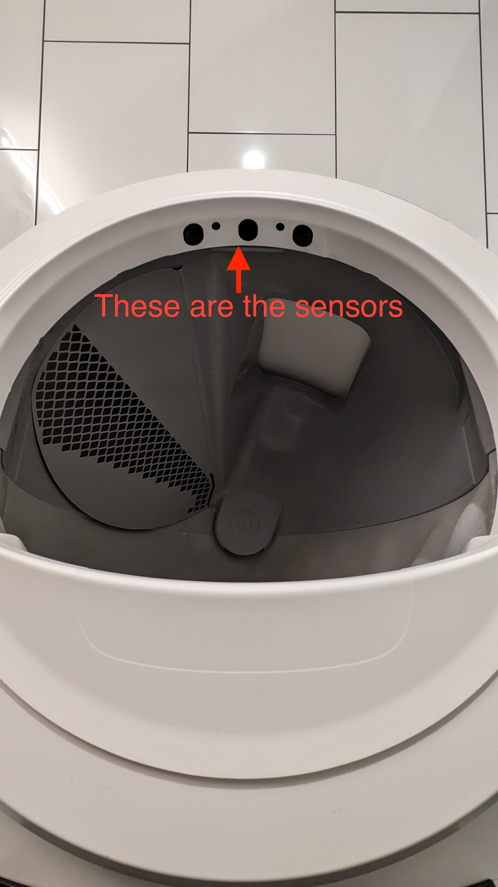

## Care

<!-- TODO: Dont hardcode colors like this -->
<label style="display: inline-block; color:#fff; margin-bottom:16px">
    <!-- TODO: pull the checkbox value from localstorage -->
    <input type="checkbox"></input>
    Feed Meep a small treat after entering to help her socialize. The treats are located above the fridge in the purple bag.
</label>

    <label style="display: inline-block; color:#fff; margin-bottom:16px">
        <input type="checkbox"></input>
        <!-- TODO: fix the link -->
        Make sure her litterbox in the bathroom isn&apos;t stuck. For instructions on how to fix it if stuck, refer to <b><u><a href="#fixing-the-litter-robot">the "fixing the litter robot" section on this page</a></b></u>
    </label>

    <label style="display: inline-block; color:#fff; margin-bottom:16px">
        <input type="checkbox"></input>
        Make sure her food bowl is not overflowing. If it is, you can just dump the food currently in the bowl back into the feeder by removing the top of the feeder. The feeder's top can be removed by depressing the 2 clips on either side of the circle in the middle of the top plate.
    </label>

    <label style="display: inline-block; color:#fff; margin-bottom:16px">
        <input type="checkbox"></input>
        Top off Meep's water bowl so that there is at least 1 inch of water in the bowl. There is a watering can in the cabinet above the microwave and you can fill it with water from the water dispenser inside the fridge. <b>NOTE: When closing the fridge, you need to make sure the water dispenser is pushed to the back of the fridge otherwise the fridge door will hit the dispenser when you close it, causing the dispenser to leak everywhere.</b> 
    </label>

    <label style="display: inline-block; color:#fff; margin-bottom:16px">
        <input type="checkbox"></input>
        Make sure the AC is maintaining 76 degrees.
    </label>

    <label style="display: inline-block; color:#fff; margin-bottom:16px">
        <input type="checkbox"></input>
        Play with Meep. Her toys are in the 3rd drawer from the top, next to the dishwasher.
    </label>

## About Meep

- Meep loves to play. Her favorite toys are the fishing rod, the feather wand, the ball with a feather at the end of it (play around with it similar to how you would use the wand), and the laser pointer.
- Meep enjoys nature documentaries. Feel free to put on <em>Our Planet</em> from Netflix, its her favorite.

<h2 id="fixing-the-litter-robot">Fixing the Litter Robot</h2>

Sometimes the litter robot may get stuck and can't finish a cleaning cycle.

<!-- TODO: include a photo of the 3 sensors -->

The only time I've had this happen was when there was a hair blocking some of the sensors. To fix that issue, you can squat down so that you can see inside the litter robot and look for 3 circular openings on the top-lip of the entrance. Brush your hand across those 3 sensors to try and clear out any debris, and then unplug the litter robot and plug it back in to immediately force the robot to cycle. The outlet for the litter robot is next to the toothbrush on the bathroom vanity.

